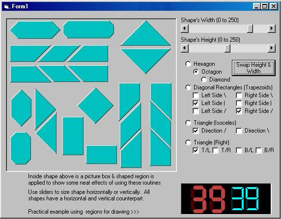



## FYI: Collection of Shaped Regions

### Description

27 shaped regions from 3 functions can be used for custom buttons, windows or whatever. The logic used is pretty easy to follow so you can create even more shapes & add them to your collection. Also included is a simple but effective routine to add 3D-ish border to those shapes & could be used to apply borders to most custom shapes. A what-if project that took off but really can't use the code for anything right now -- hope you can find a good home for it :) <>Updated to include right triangles & showing a digitial timer as a practical example of using regions for drawing.
 
### More Info
 

             |
---                |---
**Submitted On**   |2005-01-30 18:06:58
**By**             |[LaVolpe](https://github.com/Planet-Source-Code/PSCIndex/blob/master/ByAuthor/lavolpe.md)
**Level**          |Intermediate
**User Rating**    |5.0 (75 globes from 15 users)
**Compatibility**  |VB 6\.0
**Category**       |[Graphics](https://github.com/Planet-Source-Code/PSCIndex/blob/master/ByCategory/graphics__1-46.md)
**World**          |[Visual Basic](https://github.com/Planet-Source-Code/PSCIndex/blob/master/ByWorld/visual-basic.md)
**Archive File**   |[FYI\_\_Colle1845791302005\.zip](https://github.com/Planet-Source-Code/lavolpe-fyi-collection-of-shaped-regions__1-58562/archive/master.zip)

